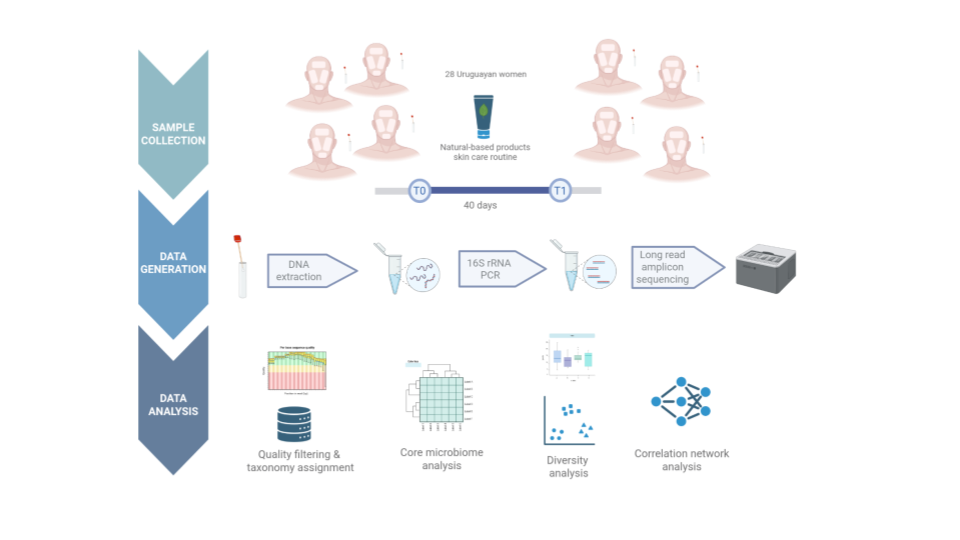

# Analysis of skin microbiome data from a uruguayan women cohort  

### Description

### Installation

    

### Dependencies

R packages:
phyloseq,
dplyr 1.0.4,
tidyverse 1.3.0,
microbiome,
vegan

### Usage 

  Download and run R scripts within the same directory where the data is stored

    Authors:

    Matías Giménez
    Cecilia Salazar
    Nadia Riera

    Microbial Genomics Laboratory
    Institut Pasteur Montevideo (Uruguay)

### Note

This is a beta version, please report bugs or misfunctions detected.
